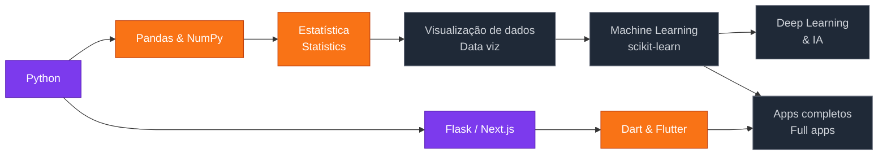

  

  

  <a href="#sobre">Sobre / About</a> ·
  <a href="#conta">Esta conta / This account</a> ·
  <a href="#objetivos">Objetivos / Goals</a> ·
  <a href="#projetos">Projetos / Projects</a> ·
  <a href="#roadmap">Roadmap</a> ·
  <a href="#stack">Stack</a> ·
  <a href="#stats">Stats</a>

---

## 🙋‍♂️ Sobre mim · About me

🇧🇷 Oi! Sou o **João Pedro de Barros Marques**, estudante de **Ciência da Computação no CEUB** (Brasília – DF). Gosto de transformar dados em respostas e ideias em aplicativos. Meu foco é desenvolver meu lado **analítico** para seguir carreira em **Ciência de Dados**, me aprofundando cada vez mais em **Inteligência Artificial**.

Sou **excelente no uso de IA como ferramenta de desenvolvimento**: as ideias, a arquitetura e as decisões são minhas, e a IA me ajuda a tirá-las do papel com mais velocidade e qualidade.

🇺🇸 Hi! I'm **João Pedro de Barros Marques**, a **Computer Science student at CEUB** (Brasília, Brazil). I enjoy turning data into answers and ideas into apps. My focus is sharpening my **analytical** skills to build a career in **Data Science**, going deeper into **Artificial Intelligence** along the way.

I'm **highly skilled at using AI as a development tool**: the ideas, design and decisions are mine, and AI helps me bring them to life faster and better.

## 🗂️ Sobre esta conta · About this account

| | 🇧🇷 | 🇺🇸 |
|---|---|---|
| 💼 **Esta conta** · *this one* | Perfil **profissional**: projetos pessoais, aplicativos e portfólio | **Professional** profile: personal projects, apps and portfolio |
| 📚 [**@joaobmarques-afk**](https://github.com/joaobmarques-afk) | Conta de **estudos**: trabalhos e atividades da faculdade | **Study** account: coursework and college assignments |

## 🎯 Objetivos · Goals

| | 🇧🇷 | 🇺🇸 |
|---|---|---|
| 📊 | Desenvolver minhas **capacidades analíticas** e me tornar **cientista de dados** | Grow my **analytical skills** and become a **data scientist** |
| 📱 | **Criar aplicativos** que resolvam problemas reais | **Build apps** that solve real problems |
| 🤖 | Me envolver cada vez mais com **IA e Ciência de Dados** | Get more and more involved in **AI and Data Science** |

## 🚀 Projetos · Projects

<table>
<tr>
<td width="72%" valign="top">

### 🌱 [EcoTracker](https://github.com/joaopbmarquesdev-dev/trabalhoboot)
🇧🇷 Sistema de controle de estoque em linha de comando para pequenos negócios. Cadastra, atualiza e remove produtos com validação de regras (sem estoque negativo), salva tudo em JSON e busca dados de produtos pelo **código de barras** via API Open Food Facts.
 🇺🇸 CLI inventory system for small businesses: product CRUD with business-rule validation, JSON persistence and **barcode lookup** through the Open Food Facts API.

</td>
<td width="28%" valign="middle" align="center">
 
 
 
 

</td>
</tr>
<tr>
<td width="72%" valign="top">

### 🔧 [Oficina](https://github.com/joaopbmarquesdev-dev/oficina)
🇧🇷 Sistema web de gestão para oficina mecânica, com login e sessão, dashboard e módulos de **clientes, mecânicos, veículos, peças e ordens de serviço**.
 🇺🇸 Web management system for an auto repair shop: authentication, dashboard and modules for **customers, mechanics, vehicles, parts and work orders**.

</td>
<td width="28%" valign="middle" align="center">
 
 

</td>
</tr>
<tr>
<td width="72%" valign="top">

### 🌐 [Desenvolvimento Web · CEUB](https://github.com/joaopbmarquesdev-dev/ceub_ciencia_2026)
🇧🇷 Coleção das minhas práticas de desenvolvimento web, organizadas por aula: páginas HTML, estilização com CSS e o framework Skeleton.
 🇺🇸 My web development practice work, organized by class: HTML pages, CSS styling and the Skeleton framework.

</td>
<td width="28%" valign="middle" align="center">
 
 

</td>
</tr>
</table>

🛠️ Mais projetos em breve · More projects coming soon

## 🗺️ Roadmap de estudos · Study roadmap

  
  
  

## 🧰 Tech stack

<b>Uso · I use</b>

   
   
  
  

<b>Aprendendo · Learning</b>

   
  
  
  
  
  
  

## 📊 Estatísticas · Stats

  
  

  

---

  
  
  

